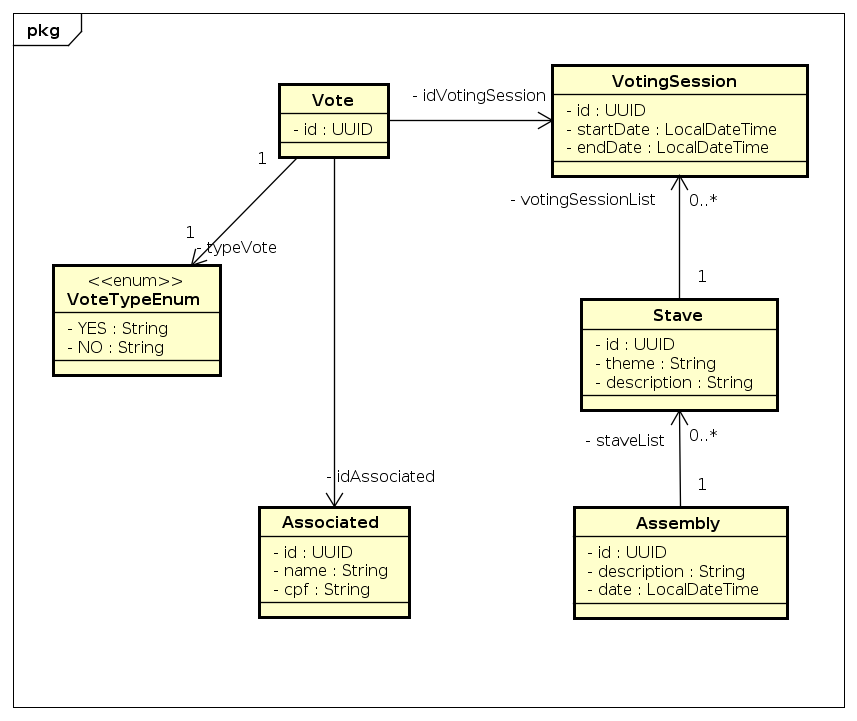
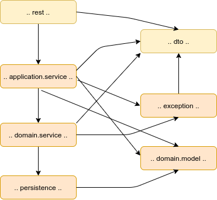

# Cooperativism API.

Servidor para testes: [clique aqui](https://cooperativism-api.herokuapp.com/api/v1).
base_url: /api/v1


## Documentações

#### OpenApi
+ Especificação OpenApi dos serviços: [clique aqui](src/main/resources/openapi/spec.yaml).

#### Detalhes dos serviços
+ Para detalhes sobre os serviços disponíveis, veja  [documentação completa da API.](src/main/resources/openapi/documentationV100.html)

#### Diagrama de Classes


#### Postman
+ Collections disponíveis para request: [clique aqui](others/doc/postman/Cooperativism.postman_collection)
+ Environments para as Collections disponíveis request: [clique aqui](others/doc/postman/cooperativism.postman_environment.json)

## API's disponíveis:

#### Associated ( Associado )
+ Cadastrar um associado.
+ Atualizar um associado.
+ Remover um associado por ID ou CPF.
+ Buscar um associado por ID ou CPF.
+ Buscar todos os associados com paginação.

#### Assembly ( Assembleia )
+ Cadastrar uma assembleia.
+ Atualizar uma assembleia.
+ Remover uma assembleia
+ Consultar uma assembleia.
+ Buscar todas as assembleias com paginação.

#### Stave ( Pauta )
+ Cadastrar uma pauta.
+ Atualizar uma pauta.
+ Remover uma pauta.
+ Consultar uma pauta.
+ Buscar todas as pautas com paginação.
+ Criar uma sessão de votação em uma pauta.
+ Votar em uma pauta
+ Contabilizar o resultado na pauta.

## Configurações

#### Versão de Java
A build terá exigências de versões específicas do Java 11.

#### Plugins
Para auxiliar no desenvolvimento é recomendado a instalação dos plugins para as seguintes ferramentas:
* [Lombok](https://projectlombok.org)

#### Liquibase

##### Organização dos changesets

**Pastas** - cada arquivo de changelog deve ficar em uma subpasta da versão em que ele está sendo incluído. Por sua vez, cada versão deve ter o seu arquivo de changelog que deve importar os arquivos de changelog daquela versão. Por fim o arquivo de changelog geral deve importar os arquivos de cada versão. Com isso conseguimos versionar nosso banco de dados.


## Packaging
Usa-se num primeiro nível, packaging by feature e num segundo nível packaging by layer.
Os objetivos são evitar os smells de big ball of mud e código espaguete.

#### components (packaging by feature)
O projeto está estruturado utilizando a ideia de componente.

Não há hoje intenção real de extrair estes componentes, mas seguir esta abordagem nos ajuda a termos componentes coesos.

|Package|Conteúdo  |
|-------|----------|
|`com.gabriellopesjds.cooperativism.rest`|Classes que compõe a camada REST.  |
|`com.gabriellopesjds.cooperativism.config`|Classes de configuração que são utilizadas na API como um todo.|
|`com.gabriellopesjds.cooperativism.exception`|Classes de exceptions que são utilizadas por todos os componantes que estão em `..domain.service..`|
|`com.gabriellopesjds.cooperativism.utils`|Classes de utilitários uteis para todas as layers.|


#### Layers (packaging by layer)
Dentro de cada component há este packaging by layer:

|Layer|Package|Propósito  |
|-----|-------|-----------|
|Application services|`..application.service..`  | Serviços que atendem a casos de uso específicos. Atendem estes casos de uso geralmente fazendo usos de classes do Domain Services. Aqui faz-se orquestrações, composições e transformações de dados.|
|Domain Services|`..domain.service..`  | Regras de negócio que *sejam inerentes ao negócio e que não sejam atreladas a um caso de uso específico.* Mais do que nunca, classes aqui devem ter granularidade fina e *SRP – Single reponsibility principle* é uma obrigação. |
|Domain Model |`..domain.model..`| Entidades. Aqui não há regras de negócio.  |
|Persistence |`..persistence..`  | Persistência. Contém as interfaces utilizadas no JPA com o `spring-data-jpa`.|


A figura abaixo resume as interações permitidas entre os layers:




### Executando a API no localhost utilizando o docker
```sh
mvn clean install -Pdocker
docker-compose up
```

###### Verifique a aplicação local no endereço :

```sh
urlBase: 127.0.0.1:8080/api/v1
```
